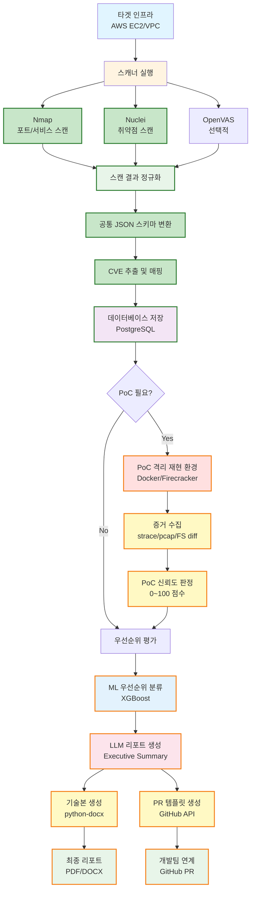

# 클라우드 기반 취약점 진단·리포트 자동화 시스템 개발
**팀명(가제): V2R (Vuln2Report)**  
**기간:** 약 6주 (2025-10-27 ~ 2025-11-28) 

**목표:** AWS 기반 테스트베드에서 자동 취약점 탐지 → PoC 격리 재현(증거수집) → PoC 신뢰도 판정 → ML 우선순위 → LLM 기반 Executive Summary 자동생성 → 개발팀용 PR/패치 템플릿 연계까지의 컨설팅형 워크플로우 MVP 구현

**요약:** AWS 격리 테스트베드에서 취약점 자동 스캐닝 → PoC 격리 재현 → 증거 기반 검증 → ML/LLM 기반 리포트 자동화까지의 컨설팅형 워크플로우 MVP 구현

### 전체 워크플로우



**구현 상태:**
- ✅ **구현 완료**: 스캐너 실행, 정규화, DB 저장, PoC 재현, 신뢰도 점수화, LLM 리포트 생성, 리포트 자동화, 대시보드
- 🟡 **선택적 기능**: ML 우선순위 모델, GitHub PR 자동 생성

**프로젝트 특성:** 1인 개발 프로젝트로 진행됩니다.

**최종 수정 일자:** 2025-01-XX (1주일 완성 계획 구현 완료)

- 상세 변경 이력은 `CHANGELOG.md`를 참고하세요.
- **로컬 PC 실행 가이드**: `QUICK_START_LOCAL.md` (권장)
- **로컬 Docker 설정**: `docs/LOCAL_DOCKER_SETUP.md` 참조
- **EC2 사용 가이드**: `docs/EC2_USAGE.md` (CCE 점검 및 클라우드 데모)
- **프로젝트 진행률**: `docs/PROGRESS_ANALYSIS.md` 참조

## 목차
- [1. 기획 의도 및 목표](#1-기획-의도-및-목표)  
- [2. 기대효과](#2-기대효과)  
- [3. 스코프(포함/제외)](#3-스코프포함제외)  
- [4. 아이디어 상세 & 파트별 핵심 포인트](#4-아이디어-상세--파트별-핵심-포인트)  
  - [4.1 Agent-Scoped 룰(정책)](#41-agent-scoped-룰정책)  
  - [4.2 에이전트 → 서버 전송 포맷](#42-에이전트--서버-전송)  
  - [4.3 원격 명령 채널](#43-원격-명령-채널)  
  - [4.4 서버 파이프라인/탐지/LLM Advisor (REST API)](#44-서버-파이프라인탐지llm-어드바이저)  
  - [4.5 DB(핵심 스키마)](#45-핵심-db-스키마)  
- [5. 우선순위: 스캔 대상 & 기법 (MVP 기준)](#5-우선순위-스캔-대상--기법-mvp-기준)  
- [6. 기술 스택 & 권장 도구 / 명령 예시](#6-기술-스택--권장-도구--명령-예시)  
- [7. 최종 산출물](#7-최종-산출물)
- [8. 6주 간 일정(주 단위)](#8-6주-간-일정)   
- [9. KPI / 성공 기준](#9-kpi--성공-기준-mvp-기준)
- [10. 개발 방법론](#10-개발-방법론)  

---

## 1. 기획 의도 및 목표
- **기획 의도:** PoC의 진위(실제 동작 여부)와 리포트 품질을 보장하는 자동화 파이프라인을 구축합니다. 단순 스캔 결과 덤프가 아니라 **격리 재현 + 증거 기반 검증 + 컨설팅형 리포트**를 목표로 합니다.
- **주요 목표:**  
  1. AWS 기반 격리 테스트 인프라(EC2/RDS/Container) 구축
  2. 스캔 → 정규화 → CVE 매핑 → 행동 기반 증거수집 → 자동 신뢰도 판정 파이프라인 구현  
  3. ML로 취약점 우선순위 보조, LLM으로 요약 자동 생성 (리포트 자동화) 통합
  4. 취약점 리포트 기반 개발팀 연계(PR 템플릿 자동생성)로 실무 적용성 확보

---

## 2. 기대효과
- **운영 효율성:** 보고서 초안 자동화로 컨설턴트 문서 작성 시간 절감  
- **대응 속도 개선:** 우선순위 자동화로 패치 의사결정 시간 단축  
- **신뢰성 향상:** PoC 재현·행동 증거 기반 검증으로 가짜 PoC·오탐 감소  
- **인재·역량 확보:** 펜테스팅·클라우드·ML/LLM 실무 역량 강화

---

## 3. 스코프(포함/제외)

**포함 (MVP)**  
- EC2 기반 Host 점검(CIS/CCE 중심)  
- 네트워크 노출·서비스 스캔(Security Group, Port)  
- RDS(PaaS) 기본 설정 점검(공개여부, 암호화 등)  
- 스캔 결과 정규화 → CVE 매핑 → 간단 PoC(비파괴) 격리 재현  
- 자동 리포트(LLM Executive Summary 포함)

**제외 (초기)**  
- 프로덕션 직접 테스트(엄격 금지)  
- 고도화된 IAM 권한 심층분석(선택)  
- 자동 공격(승인 이후)

---

## 4. 아이디어 상세 내용 & 파트별 핵심 포인트

### A. 인프라(테스트베드)
- **내용:** AWS VPC(격리) + EC2(웹·DB) 또는 컨테이너로 취약앱(DVWA, Juice Shop) 배포. Terraform으로 IaC 관리.
- **핵심 포인트:** 완전 격리, 스냅샷/롤백 가능 이미지(AMI), 증거 저장소(S3) 및 접근제어.
- **웹 어플리케이션**
  - 간단한 웹페이지(예: 취약 입력 처리)와 데모 취약점 시나리오 포함.
  - 예시 CVE(직관적 RCE 타입) 1~2건을 재현 가능한 환경 구성(단, exploit 코드/공격 방법은 포함하지 않음).  
    - 예) `CVE-2021-44228 (Log4Shell)` 또는 팀 합의에 따른 동급의 직관적 RCE CVE 식별자(README에는 식별자만 표기).
- **취약 설정**
  - MySQL 포트(3306) 공개(외부 접근 허용) — 보안그룹 의도적 설정  
  - SSH 포트(22) 공개(외부 접근 허용) — 보안그룹 의도적 설정  
  - 불필요 서비스 실행, 취약 버전 패키지 등

### B. 스캐너 통합 및 인게스천
- **내용:** Nmap/Amass 자산탐지 → Nuclei/OpenVAS 취약점 스캔 → 결과 정규화(공통 스키마).
- **핵심 포인트:** 결과 표준화(메타데이터 포함), PoC 자동 인게스트(출처·해시 포함).

### C. PoC 격리 재현 엔진 & 증거수집
- **내용:** PoC 실행은 컨테이너/경량 VM(예: Docker + Firecracker)에서 수행. 실행 전후 스냅샷, 행동 로그(시스템콜, pcap, FS 변화) 수집.
- **핵심 포인트:** 행동 기반 매칭(정적 성공 여부가 아닌 행위로 검증), 재현 실패 시 자동 롤백, 증거(스크린샷/PCAP/로그) 수집.

### D. PoC 진위 검증 & 신뢰도 점수화
- **내용:** 정적분석(가짜 코드 패턴 탐지) + 동적행동 매칭 → 신뢰도(0~100) 산출. 신뢰도 임계값 이하면 큐레이션(사람 검토).
- **핵심 포인트:** 출처 가중치(Exploit-DB 등), 행동 증거 가중치, 자동/수동 워크플로우 연계.

### E. ML / LLM 연동
- **내용:**  
  - ML: 취약점 메타데이터 기반 우선순위 분류(XGBoost 등).  
  - LLM: 취약점 요약/Executive Summary 자동 생성, RAG로 증거 인용 가능.
- **핵심 포인트:** 휴먼-in-the-loop, LLM 결과는 증거와 함께 제공하여 검증 가능하게 함.

### F. 리포트 자동화 & 개발 연계
- **내용:** python-docx/ReportLab로 기술본 자동생성 + LLM으로 임원요약 작성 → GitHub/GitLab API로 PR/Issue 템플릿 자동 생성.
- **핵심 포인트:** 임원용(한 장 요약) + 기술본(증거 포함) 분리 제공, PR 템플릿에 재현 방법·패치 스니펫 포함.

### G. 대시보드 / UI
- **내용:** Streamlit 또는 React 기반 대시보드: 취약점 리스트, 신뢰도, 증거 다운로드, 리포트 생성 버튼, PR 생성 버튼.
- **핵심 포인트:** 사용성(빠른 검토), 큐레이션 인터페이스(사람 검토/승인).

### 에이전트 정책·전송·명령·서버 파이프라인 예시

#### 4.1 Agent-Scoped 룰(정책)
- **개념:** 서명된 정책(YAML/JSON)으로 에이전트 수집 동작을 제어. 우선순위: `global < client < host`.  
- **룰 항목(예):** include/exclude, redact(정규식 마스킹), sampling, rate_limit, local_hold.  
```yaml
client_id: acme-web
version: 3
rules:
  - include_paths: ["/var/log/nginx/access.log"]
    redact:
      - field: "url.query"
        pattern: "(token|session|pwd)=([^&]+)"
        replace: "$1=***"
  - exclude_paths: ["/var/log/app/debug.log"]
  - sampling:
      match: "event.category == 'web'"
      rate_per_sec: 200
```
- include/exclude 및 redact 우선 구현. 정책 서명/버전 관리 등은 차후 확장.

#### 4.2 에이전트 → 서버 전송
- 구성: `meta` + `security` + `ciphertext`
- 필드: `nonce`, `timestamp`, `agent_id`, `client_id`, `key_id`, `payload_hash`(SHA-256), `signature`
```json
{
  "meta": { "server_id":"srv-collector-01", "client_id":"acme-web", "agent_id":"agent-10",
            "timestamp":"2025-10-01T02:15:30Z", "nonce":"7c1f...a9" },
  "security": { "enc_alg":"AES-256-GCM", "key_id":"k-2025-09",
                "payload_hash":"sha256:3e9f...b7", "signature":"base64-optional" },
  "ciphertext": "base64-blob"
}
```
- TLS 전송 + `payload_hash` 무결성 검증 우선, payload 레벨 암호화(AES-GCM + KMS)는 차후 확장 고려

#### 4.3 원격 명령 채널
- 통신 모델: Pull(heartbeat), Push(gRPC/WebSocket) 중 환경에 맞춰 선택
- 보안 통제: mTLS + 명령 서명 + 권한 스코프 + 감사 로그

- 서버 → 에이전트 예시:
```json
{ "job_id":"uuid","type":"RULES_RELOAD","args":{"policy_version":"5"},
  "issued_at":"2025-10-01T02:20:00Z","signature":"base64" }
```

- 에이전트 → 서버(결과) 예시:
```json
{ "job_id":"uuid","status":"SUCCESS","stdout":"...","started_at":"...", "finished_at":"...", "agent_sig":"base64" }
```
- RULES_RELOAD, PING/HEALTH 명령 우선 구현

#### 4.4 서버 파이프라인/탐지/LLM 어드바이저
- 파이프라인: `Ingest → Normalize(ECS-lite) → Enrich(GeoUP/UA) → Detect(Rule + ML) → Event`
- LLM 어드바이저: RAG 방식으로 권고 생성, 결과는 JSON 스키마로 반환
- API:
  - `POST /ingest/logs` → 수신,검증,저장
  - `POST /detect/run` → Rule, ML 실행
  - `POST /advice` → LLM 요약/가이드(JSON 형식)
  - `GET /events` / `GET /incidents/{id}` → 조회
  - `GET /export.{pdf|json|csv}` → 산출물

수신 로그는 ECS-lite 형태로 정규화·인리치먼트(GeoIP/UA) 되고, 룰 기반 탐지와 ML(rolling metrics/IForest/EWMA)이 결합된 하이브리드 이벤트를 생성합니다. 
LLM Advisor는 RAG(근거: Top-K)로 증거를 인용한 권고(제안)만 제공하며 JSON 스키마로 출력합니다

#### 4.5 핵심 DB 스키마
- `raw_logs`, `events`, `incidents`, `rules`, `agents`, `clients`, `users`, `audit_trail`, `report`
- 스키마 예시:
```sql
CREATE TABLE agents (
  agent_id TEXT PRIMARY KEY,
  client_id TEXT,
  server_fingerprint TEXT,
  cert_key_id TEXT,
  version TEXT,
  last_seen TIMESTAMP,
  health JSONB
);

CREATE TABLE raw_logs (
  id BIGSERIAL PRIMARY KEY,
  ts TIMESTAMP NOT NULL,
  host_name TEXT,
  source_type TEXT,
  raw_line TEXT,
  hash_sha256 TEXT,
  client_id TEXT,
  agent_id TEXT,
  tags TEXT[],
  created_at TIMESTAMP DEFAULT now()
);

CREATE TABLE events (
  id BIGSERIAL PRIMARY KEY,
  ts TIMESTAMP NOT NULL,
  event_category TEXT,
  severity INT,
  summary TEXT,
  evidence_refs JSONB,
  rule_id TEXT,
  ml_score FLOAT,
  client_id TEXT,
  host_name TEXT,
  source_ip TEXT,
  url_path TEXT
);
```
- **민감 필드 암호화, 파티셔닝, RBAC 및 감사 로깅 필수**

---

## 5. 우선순위: 스캔 대상 & 기법
**대상:** Host(EC2), Network(SecurityGroup/VPC), RDS(PaaS), Container image
- 주요 기법:
  - 1. Host 설정 점검 (CIS/CCE) → Lynis, OpenVAS / Trivy
  - 2. 서비스/포트 스캐닝 → Nmap
  - 3. 취약점 스캐닝 → Nuclei / OpenVAS / Trivy / 필요시 Fuzzer 활용
  - 4. 네트워크 노출 점검 → awscli / VPC Reachability / VPC Flow Logs 분석

이후, IAM 심층 분석 및 RAG 고도화 등 확장 고려

**외부 스캐닝 절차**
EC2를 대상으로 외부에서 접근 가능하다고 가정하고 스캐닝을 진행한다.

1. **네트워크 스캔** (목적: 열린 포트/서비스 식별)  
   - 도구: Nmap, Masscan(빠른 탐지)  
   - 출력: 열린 포트 리스트, 서비스·버전, 보안그룹 노출 상태  

2. **CVE 스캔 / 취약점 매핑** (목적: 알려진 취약점 식별)  
   - 도구: Nuclei(템플릿), OpenVAS/Nessus, Trivy(이미지 취약점)  
   - 출력: 취약 항목 → CVE 매핑, 심각도

3. **DAST (웹 동적 분석)** (목적: 웹 애플리케이션 취약점 탐지)  
   - 도구: OWASP ZAP, Burp Suite(Community) — 자동 스캔 모드  
   - 출력: XSS, SQLi, RCE 가능성(펌프 테스트는 제한적·비파괴), 웹 응답 패턴

4. **정규화 & 리포트**  
   - 각 스캐너 결과를 공통 스키마(JSON)으로 정규화 → DB 적재 → 우선순위 후보 추출

**CCE 기반 내부 서버 점검**
금융보안원에서 제공한 서버(Linux) 항목을 기준으로 내부자 관점 점검 스크립트를 작성 및 CCE 점검 실시

- **체크 항목:** (예시) SSH 설정(허용된 암호화 알고리즘), root 원격 접속 여부, 패스워드 정책, 불필요 서비스, 파일권한, 로그 설정, 패치 상태 등 — 금융보안원 기준 Linux 항목을 우선 반영
- **판정 로직:** 각 항목에 대해 IF 조건으로 **양호 / 취약 / 주의** 판정
  - 예: `if sshd_config.PasswordAuthentication == "no" then status = "양호" else status = "취약"`
- **출력 포맷:** JSON(권장) 및 XML 선택 출력 가능  
- 기본 JSON 예시:
    ```json
    {
      "host": "test-ec2-01",
      "checks": [
        {"id": "CCE-LNX-001", "title": "SSH PasswordAuth", "result": "취약", "detail": "sshd_config: PasswordAuthentication yes"},
        {"id": "CCE-LNX-002", "title": "Root login", "result": "양호", "detail": "PermitRootLogin no"}
      ],
      "summary": {"total": 2, "pass": 1, "fail": 1, "timestamp": "2025-10-27T10:00:00Z"}
    }
    ```
- **보고서:** 개별 호스트 JSON / 전체 요약 JSON 혹은 XML 리포트 생성

- Ansible 연동을 통해 여러 EC2 서버 대상에 CCE 점검 스크립트를 일괄 배포 및 실행하고 결과 수집을 자동화하여 편의성 향상

---

## 6. 기술 스택 & 권장 툴 (예시, 필요에 따라 변경)
- Infra / IaC: AWS (VPC/EC2/RDS/S3), Terraform
- 스캐닝 / 검사: Nmap, Lynis, OpenSCAP, Nuclei, OpenVAS, Trivy
- PoC 재현 / 격리: Docker, Firecracker(활용 가능시) / Kata Containers, AMI Snapshot
- 데이터 파이프라인: Python, PostgreSQL, S3
- ML / LLM: OpenAI API or local LLM
- 대시보드: Streamlit / React
- 증거 수집: tcpdump/tshark, strace/eBPF, inotify/FS diff

---

---

## 7. 최종 산출물
1. **Terraform 템플릿** — 격리 테스트 VPC 및 인프라 코드  
2. **PoC 재현 엔진 코드** — 컨테이너/VM 오케스트레이션 스크립트(스냅샷·롤백 포함)  
3. **증거 수집 아티팩트** — pcap, syscall logs, FS diff, 스크린샷 (샘플)  
4. **PoC 신뢰도 DB** — PoC 메타데이터(출처·해시·버전·신뢰도)  
5. **스캐너 통합 파이프라인 코드** — 결과 정규화 스크립트  
6. **우선순위 ML 모델** — 학습 코드, 모델 파일, 평가 리포트  
7. **LLM 프롬프트 템플릿 & 리포트 자동화 모듈** — Executive Summary 생성 샘플  
8. **대시보드(웹)** — 취약점 리스트·신뢰도·증거·리포트 다운로드·PR 버튼  
9. **최종 보고서(PDF) & 데모 영상** — 프로젝트 요약·결과·KPI  
10. **README, 운영 절차 문서** — 사용법, 승인/증거보관/파기 정책

---

## 8. 6주 간 일정
> **운영원칙:** 주간 경과보고 1회(각 주 금요일), 매 주 월요일 주간 계획 브리핑 / 수요일 중간 브리핑 || 총 주 3회 

- **Week 0 (사전, 2–3일)**  
  - 레포·Notion 초기화, 개발 방법론 설정

- **Week 1 — 인프라 준비 & 테스트앱 배포**  
  - Terraform 기본, VPC/서브넷/보안그룹, DVWA/ Juice Shop 배포, 신뢰 PoC 목록 수집

- **Week 2 — PoC 재현 엔진 & 증거수집 기본 구현**  
  - 컨테이너 재현 스크립트(스냅샷/롤백), strace/tcpdump 자동수집, FS diff

- **Week 3 — 스캐너 통합 및 파이프라인 연결**  
  - Nmap/Nuclei/OpenVAS 연동, 결과 정규화, 인게스천→재현 연계 테스트

- **Week 4 — 리포트 자동화(LLM PoC) 및 대시보드 MVP**  
  - LLM 연동(요약 샘플), python-docx 리포트 템플릿, Streamlit 대시보드 기본

- **Week 5 — ML 우선순위(초안) & PR 연동**  
  - 간단한 우선순위 모델 학습(샘플), GitHub PR 자동화 스크립트

- **Week 6 — 통합테스트, KPI 측정, 문서화, 발표**  
  - 전체 플로우 검증, PoC 재현 성공률·신뢰도 측정, 최종보고서·데모·PPT 준비

---

## 9. KPI / 성공 기준 (MVP 기준)
- PoC 재현 성공률 ≥ 60%
- 자동 CVE 매핑과 수동 매핑 검토 일치율 ≥ 80%
- 자동 리포트 초안 완성도 (개발자 내부적 판단)
- 스캔 범위: 테스트 이미지 내 80% 이상

---

## 10. 개발 방법론

### Personal Kanban + MVP-First Iterative Development

본 프로젝트는 1인 개발 프로젝트의 특성에 맞춘 **Personal Kanban + MVP-First** 방법론을 적용합니다.

#### 선택 이유
- **1인 개발**: 전통적 스크럼/애자일은 팀 협업 중심, 1인에겐 과함
- **6주 제한**: 명확한 마일스톤, 빠른 피벗 필요
- **복잡한 시스템**: 여러 모듈 병렬 진행 가능, 우선순위 관리 필수
- **MVP 목표**: 핵심 기능 중심 점진적 완성

#### 방법론 구조

**1. Personal Kanban 보드 구조**
```
[Backlog] → [This Week] → [In Progress] → [Blocked] → [Review] → [Done]
```

**2. 주 단위 Sprint (Week-based)**
- **주간 목표**: README의 Week N 목표에 맞춤
- **주간 회고**: 금요일 (완료/진행/차단 항목 정리)
- **다음 주 계획**: 주말 또는 월요일 (우선순위 재조정)

**3. 작업 단위 (Task Granularity)**
- **에픽(Epic)**: 섹션 4의 A~G 파트
- **스토리(Story)**: 기능 단위 (예: "PoC 격리 실행 환경 구축")
- **태스크(Task)**: 2-4시간 작업 단위 (예: "Docker 컨테이너 스크립트 작성")

**4. MVP 우선순위 원칙**
1. **Must Have**: 핵심 파이프라인 (스캔 → 재현 → 리포트)
2. **Should Have**: 신뢰도 점수화, ML 우선순위
3. **Nice to Have**: 대시보드 고도화, 자동화 확장

**5. 위험 관리**
- **차단(Blocked)**: 의존성/인프라 문제 즉시 식별
- **조기 실패**: 주 2-3일 내 핵심 기능 검증
- **롤백 계획**: 각 주말에 다음 주 대안 준비

**6. 일일 루틴 (선택)**
- **매일 아침**: 오늘 할 3가지 우선순위 설정
- **매일 저녁**: 진행 상황 기록, 내일 계획
- **차단 발생 시**: 즉시 문서화, 대안 탐색

#### 도구 추천
- **간단한 버전**: GitHub Projects / GitHub Issues
- **중간 버전**: Notion 데이터베이스
- **최소 버전**: 마크다운 파일 (PROJECT_KANBAN.md)

#### 성공 지표
- 주당 완료 태스크 수 (속도 추적)
- 차단 시간 최소화 (Blocked → Done 평균 시간)
- MVP 목표 달성률 (주간 목표 대비)

---
