# V2R (Vuln2Report)

클라우드 기반 취약점 진단 및 리포트 자동화 시스템

## 개요

V2R은 AWS 기반 격리 테스트베드에서 취약점을 자동으로 스캔하고, PoC를 격리 환경에서 재현하며, 증거를 수집하여 신뢰도를 평가한 후, LLM 기반 리포트를 자동 생성하는 컨설팅형 워크플로우를 제공합니다.

### 주요 기능

- **자동화된 취약점 탐지**: Nmap, Nuclei 등 다양한 스캐너를 통합하여 포트 스캔, 서비스 탐지, 취약점 식별
- **격리된 PoC 재현**: Docker 기반 격리 환경에서 PoC를 안전하게 재현하고 증거 수집
- **신뢰도 기반 검증**: 출처 및 증거 기반으로 PoC의 신뢰도를 0-100 점수로 평가
- **CCE 기반 점검**: 금융보안원 기준 Linux 서버 보안 설정 점검 자동화
- **자동 리포트 생성**: LLM을 활용하여 Executive Summary와 기술본을 자동 생성
- **Agent 기반 분산 스캔**: 로컬 PC의 Agent를 통해 Docker 기반 스캔을 실행하고 결과를 EC2 서버로 전송

## 아키텍처

```mermaid
flowchart LR
    %% =========================
    %% Subgraphs (영역 정의)
    %% =========================
    subgraph Control["🖥️ Control Plane (EC2)"]
        Dashboard["📊 Dashboard"]
        API["🔌 API Server (Flask)"]
        DB[("💾 PostgreSQL")]
        Report["📄 Report Generator"]
    end

    subgraph Exec["💻 Execution Plane (Agent Host)"]
        Agent["🤖 Agent"]
        Docker["🐳 Docker Runtime"]

        subgraph Scan["🔍 Scanner Pipeline"]
            Nmap["Nmap<br/>Port Scan"]
            Nuclei["Nuclei<br/>CVE Scan"]
            VulnCheck["Vuln Checker<br/>Unauth Check"]
        end

        subgraph CCEArea["🛡️ CCE Checks"]
            CCEScript["CCE Script"]
        end

        subgraph AnsibleArea["⚙️ Ansible Remote Exec"]
            AnsibleExec["Ansible"]
        end
    end

    subgraph Target["🎯 Target: CVE-Lab"]
        WebApp["Vulnerable Web Apps<br/>(Jenkins, Log4j, etc.)"]
    end

    %% =========================
    %% Main Flow
    %% =========================
    Dashboard -->|Create job| API
    API -->|Assign job| Agent
    Agent -->|Poll / Fetch| API

    Agent --> Docker
    Docker --> Scan

    Scan -->|Scan target| WebApp
    Scan --> Nmap
    Scan --> Nuclei
    Scan --> VulnCheck

    %% CCE & Ansible
    Agent --> CCEScript
    CCEScript -->|Remote check| AnsibleExec
    AnsibleExec -->|Check target| WebApp

    %% Result flow
    Agent -->|Upload results| API
    API -->|Store| DB
    DB -->|Query| Dashboard
    DB -->|Raw data| Report
    Report -->|Final report| Dashboard

    %% =========================
    %% Styles
    %% =========================
    classDef controlStyle fill:#e1f5ff,stroke:#01579b,stroke-width:2px;
    classDef execStyle fill:#fff4e1,stroke:#e65100,stroke-width:2px;
    classDef targetStyle fill:#fce4ec,stroke:#c2185b,stroke-width:2px;
    classDef scanStyle fill:#e8f5e9,stroke:#2e7d32,stroke-width:2px;
    classDef cceStyle fill:#f3e5f5,stroke:#7b1fa2,stroke-width:2px;
    classDef ansibleStyle fill:#fff9c4,stroke:#f57f17,stroke-width:2px;

    class Dashboard,API,DB,Report controlStyle;
    class Agent,Docker execStyle;
    class Scan scanStyle;
    class CCEArea cceStyle;
    class AnsibleArea ansibleStyle;
    class WebApp targetStyle;
```



### 아키텍처 설명

**EC2 서버 (중앙 관리)**
- **Streamlit Dashboard**: 웹 기반 대시보드로 Agent 관리, 작업 생성, 결과 조회
- **Flask API Server**: Agent와 통신하는 REST API 서버
- **PostgreSQL**: 스캔 결과, PoC 재현 결과, CCE 점검 결과 저장
- **Report Generator**: LLM 기반 리포트 자동 생성

**로컬 PC**
- **Agent**: EC2 서버로부터 작업을 받아 로컬에서 실행하는 Python 프로그램
- **Docker**: 스캐너 실행을 위한 격리 환경

**Scanner Pipeline**
- **Nmap**: 포트 스캔 및 서비스 버전 탐지
- **Nuclei**: 템플릿 기반 취약점 스캔
- **Vulnerability Checker**: Redis, MongoDB 등 특정 서비스 무인증 접근 체크

**취약 환경 (CVE-Lab)**
- Jenkins, Log4j, Elasticsearch, Redis, MongoDB 등 취약 웹앱 컨테이너

**CCE 점검**
- 금융보안원 기준 Linux 서버 보안 설정 점검 스크립트
- Ansible을 통한 원격 서버 점검 지원

### 워크플로우

1. **작업 생성**: 대시보드에서 Agent에게 작업 생성 (Docker 상태 조회, 전체 스캔, CCE 점검)
2. **작업 할당**: Flask API가 작업을 Agent에게 할당
3. **스캔 실행**: Agent가 로컬 Docker 환경에서 스캐너 실행
4. **결과 수집**: 스캔 결과를 API 서버로 업로드
5. **데이터 저장**: PostgreSQL에 결과 저장
6. **결과 조회**: 대시보드에서 결과 확인 및 리포트 생성

## 빠른 시작

### 1. EC2 서버 배포

#### 1.1 서버 정보
- **OS**: Amazon Linux 2023
- **인스턴스 타입**: t3.small 이상 권장
- **SSH 사용자**: ec2-user

#### 1.2 초기 설정

```bash
# SSH 접속
ssh -i your-key.pem ec2-user@YOUR_EC2_IP

# 시스템 업데이트 및 필수 패키지 설치
sudo dnf update -y
sudo dnf install -y python3.11 python3-pip git docker docker-compose postgresql15 nmap gcc gcc-c++ make python3-devel curl wget

# Docker 시작 및 자동 시작 설정
sudo systemctl start docker
sudo systemctl enable docker
sudo usermod -aG docker $USER

# 재로그인 (Docker 그룹 적용)
exit
# 다시 SSH 접속
```

#### 1.3 프로젝트 배포

```bash
# Git 클론
cd ~
git clone https://github.com/J1-MI/V2R.git
cd V2R
```

#### 1.4 환경 변수 설정

`.env` 파일 생성:

```bash
cd ~/V2R
nano .env
```

**.env 파일 내용:**

```env
# 데이터베이스 설정
DB_HOST=postgres
DB_PORT=5432
DB_NAME=v2r
DB_USER=v2r
DB_PASSWORD=v2r_password_변경필요

# API 서버 설정
API_SERVER_URL=http://api:5000
FLASK_ENV=production

# LLM 설정 (리포트 생성용 - 필수)
OPENAI_API_KEY=sk-proj-...
LLM_MODEL=gpt-4o-mini
```

#### 1.5 Docker Compose 실행

```bash
cd ~/V2R
docker-compose -f docker-compose.prod.yml up -d

# 서비스 상태 확인
docker-compose ps

# API 서버 확인
curl http://localhost:5000/api/agents
# 예상 응답: {"success":true,"agents":[]}

# Streamlit 대시보드 실행
docker exec -d v2r-app streamlit run src/dashboard/app.py \
    --server.port 8501 \
    --server.address 0.0.0.0
```

#### 1.6 보안 그룹 설정

EC2 보안 그룹에서 다음 포트를 열어야 합니다:
- **SSH (22)**: 서버 접속용
- **Streamlit 대시보드 (8501)**: 외부 접근용
- **Flask API 서버 (5000)**: Agent 통신용

---

### 2. 로컬 PC Agent 설정

#### 2.1 환경 변수 설정

**Windows PowerShell:**
```powershell
$env:AGENT_SERVER_URL="http://YOUR_EC2_IP:5000"
$env:AGENT_NAME="my-local-agent"

# Nuclei 설정 (선택)
$env:NUCLEI_BINARY_PATH="C:\path\to\nuclei.exe"
$env:NUCLEI_TEMPLATES_DIR="C:\path\to\nuclei-templates"

# 데이터베이스 설정 (Agent가 직접 DB에 저장하는 경우)
$env:DB_HOST="YOUR_EC2_IP"
$env:DB_PORT="5432"
$env:DB_USER="v2r"
$env:DB_PASSWORD="v2r_password"
$env:DB_NAME="v2r"
```

**Linux/Mac:**
```bash
export AGENT_SERVER_URL="http://YOUR_EC2_IP:5000"
export AGENT_NAME="my-local-agent"

# Nuclei 설정 (선택)
export NUCLEI_BINARY_PATH="/usr/local/bin/nuclei"
export NUCLEI_TEMPLATES_DIR="/usr/local/share/nuclei-templates"

# 데이터베이스 설정
export DB_HOST="YOUR_EC2_IP"
export DB_PORT="5432"
export DB_USER="v2r"
export DB_PASSWORD="v2r_password"
export DB_NAME="v2r"
```

또는 프로젝트 루트에 `.env` 파일 생성:

```env
AGENT_SERVER_URL=http://YOUR_EC2_IP:5000
AGENT_NAME=my-local-agent
NUCLEI_BINARY_PATH=C:\path\to\nuclei.exe
NUCLEI_TEMPLATES_DIR=C:\path\to\nuclei-templates
DB_HOST=YOUR_EC2_IP
DB_PORT=5432
DB_USER=v2r
DB_PASSWORD=v2r_password
DB_NAME=v2r
```

#### 2.2 Agent 실행

```bash
cd ~/V2R  # 프로젝트 루트
python src/agent/main.py
```

**예상 로그:**
```
INFO:src.agent.agent:Agent 등록 시도: my-local-agent
INFO:src.agent.agent:✅ Agent 등록 완료: agent_my-local-agent_...
INFO:src.agent.storage:설정 파일 저장 완료: ~/.v2r_agent/config.json
INFO:src.agent.agent:Agent 시작: agent_my-local-agent_...
INFO:src.agent.agent:폴링 간격: 10초
```

Agent는 자동으로 EC2 서버에 등록되고, 토큰은 `~/.v2r_agent/config.json`에 저장되어 재시작 시 재사용됩니다.

---

### 3. 테스트 시나리오 (FULL_SCAN + CCE_CHECK)

#### 3.1 대시보드 접속

브라우저에서 다음 URL로 접속:
```
http://YOUR_EC2_IP:8501
```

#### 3.2 Agent 확인

1. "Agent & Local Scanner" 페이지 선택
2. 등록된 Agent 목록 확인 (🟢 온라인 상태)

#### 3.3 작업 생성 및 실행

**순서대로 다음 작업을 생성:**

1. **Docker 상태 조회**
   - Agent 목록에서 "Docker 상태 조회" 버튼 클릭
   - 작업 생성 확인: "✅ 작업 생성 완료: task_..."
   - Agent 로그에서 작업 처리 확인

2. **전체 스캔 실행 (FULL_SCAN)**
   - Agent 목록에서 "전체 스캔 실행" 버튼 클릭
   - 작업 생성 확인
   - Agent 로그에서 스캔 진행 상황 확인
   - 예상 시간: 5-10분 (CVE-Lab 5개 서비스 스캔)

3. **CCE 점검 실행**
   - Agent 목록에서 "CCE 점검 실행" 버튼 클릭
   - 작업 생성 확인
   - Agent 로그에서 점검 진행 상황 확인

#### 3.4 결과 확인

**대시보드에서 확인:**

1. **대시보드 페이지**
   - 총 스캔 결과 수 확인
   - Critical/High 취약점 개수 확인
   - 심각도별 분포 차트 확인
   - 최근 스캔 결과 목록 확인 (5개 서비스: Elasticsearch, Log4j, Jenkins, Redis, MongoDB)

2. **취약점 리스트 페이지**
   - 발견된 취약점 상세 정보 확인
   - CVE 목록 확인

3. **PoC 재현 결과 페이지**
   - PoC 재현 성공/실패 상태 확인
   - 신뢰도 점수 확인

4. **CCE 점검 결과 페이지**
   - CCE 점검 결과 확인
   - 양호/취약/해당 없음 통계 확인

5. **리포트 생성 페이지**
   - "리포트 생성" 버튼 클릭
   - LLM 연결 상태 확인 (✅ LLM 연결 성공)
   - 리포트 생성 완료 후 다운로드 버튼 클릭
   - DOCX 파일 다운로드 확인

#### 3.5 예상 결과

**스캔 결과:**
- Nmap 스캔: 5개 서비스 포트 발견
- Nuclei 스캔: Log4j (CVE-2021-44228) 등 취약점 발견
- PoC 재현: Log4j PoC 재현 성공 (신뢰도 70+)
- CCE 점검: 5개 컨테이너 × 77개 항목 = 385개 점검 결과

**대시보드:**
- Critical 취약점: 1개 이상 (Log4j)
- High 취약점: 1개 이상 (Redis 무인증 등)
- 총 스캔 결과: 10개 이상

**리포트:**
- Executive Summary: LLM 기반 요약 포함
- 취약점 상세: 발견된 취약점 목록
- 증거 참조: PoC 재현 증거 파일 경로
- 권고사항: 심각도별 권고사항

---

## 프로젝트 구조

```
V2R/
├── src/                    # 소스 코드
│   ├── agent/             # Agent 프로그램
│   ├── api/               # Flask API 서버
│   ├── cce/               # CCE 점검 모듈
│   ├── dashboard/         # Streamlit 대시보드
│   ├── database/          # 데이터베이스 모델 및 Repository
│   ├── llm/               # LLM 리포트 생성
│   ├── pipeline/          # 스캔/PoC 파이프라인
│   ├── poc/               # PoC 재현 모듈
│   ├── report/             # 리포트 생성
│   ├── scanner/           # 스캐너 모듈
│   └── utils/              # 유틸리티
├── scripts/               # 스크립트
│   ├── agent/             # Agent 실행 스크립트
│   ├── deployment/        # 배포 스크립트
│   ├── test/              # 테스트 스크립트
│   └── utils/             # 유틸리티 스크립트
├── docs/                   # 문서
├── infra/                  # 인프라 설정 (Terraform, Docker)
├── docker-compose.yml      # 개발 환경 Docker Compose
├── docker-compose.prod.yml # 프로덕션 환경 Docker Compose
├── requirements.txt         # Python 패키지 의존성
└── README.md               # 이 파일
```

## 주요 기술 스택

- **Backend**: Python 3.11+, Flask, SQLAlchemy
- **Database**: PostgreSQL
- **Frontend**: Streamlit
- **Scanner**: Nmap, Nuclei
- **Container**: Docker, Docker Compose
- **LLM**: OpenAI API (GPT-4o-mini)
- **Infrastructure**: AWS EC2, Terraform

## 환경 변수

### EC2 서버 (.env)

```env
# 데이터베이스
DB_HOST=postgres
DB_PORT=5432
DB_NAME=v2r
DB_USER=v2r
DB_PASSWORD=v2r_password

# API 서버
API_SERVER_URL=http://api:5000
FLASK_ENV=production

# LLM (필수)
OPENAI_API_KEY=sk-proj-...
LLM_MODEL=gpt-4o-mini
```

### 로컬 PC Agent (.env)

```env
# Agent 설정
AGENT_SERVER_URL=http://YOUR_EC2_IP:5000
AGENT_NAME=my-local-agent

# Nuclei (선택)
NUCLEI_BINARY_PATH=C:\path\to\nuclei.exe
NUCLEI_TEMPLATES_DIR=C:\path\to\nuclei-templates

# 데이터베이스 (Agent가 직접 DB에 저장하는 경우)
DB_HOST=YOUR_EC2_IP
DB_PORT=5432
DB_USER=v2r
DB_PASSWORD=v2r_password
DB_NAME=v2r
```

## 문제 해결

### API 서버 연결 실패

```bash
# EC2 서버에서 확인
docker-compose logs api
docker-compose ps api

# 보안 그룹 확인 (포트 5000 열기)
```

### Agent 등록 실패

```bash
# 로컬 PC에서
# 1. 방화벽 확인
# 2. EC2 보안 그룹에서 포트 5000 열기 확인
# 3. Agent 로그 확인
```

### Streamlit 대시보드 접속 불가

```bash
# EC2 서버에서
docker exec v2r-app ps aux | grep streamlit
# 실행되지 않으면:
docker exec -d v2r-app streamlit run src/dashboard/app.py \
    --server.port 8501 \
    --server.address 0.0.0.0
```

### LLM 연결 실패

```bash
# .env 파일 확인
cat .env | grep OPENAI_API_KEY

# Docker 컨테이너에서 환경 변수 확인
docker exec v2r-app env | grep OPENAI_API_KEY

# Docker 재시작
docker-compose restart app
```

## 추가 문서

- **프로젝트 구조**: `docs/PROJECT_STRUCTURE.md`
- **EC2 배포 가이드**: `docs/EC2_DEPLOYMENT_GUIDE.md`
- **PoC 목록**: `docs/POC_LIST.md`

## 라이선스

MIT License - 자세한 내용은 `LICENSE` 파일을 참조하세요.

## 기여

이슈 및 풀 리퀘스트를 환영합니다. 자세한 내용은 프로젝트 저장소를 참조하세요.
